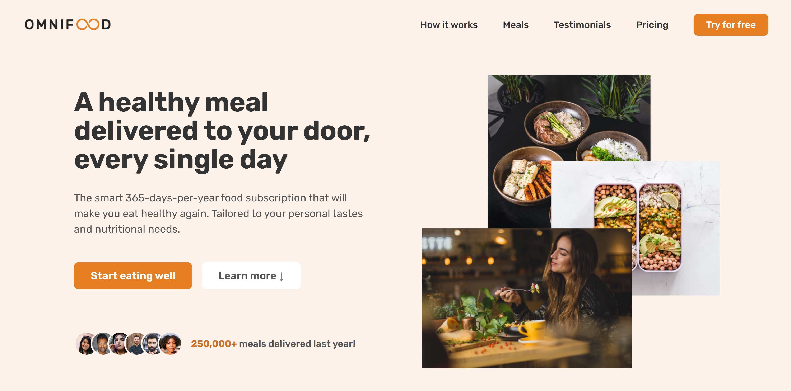
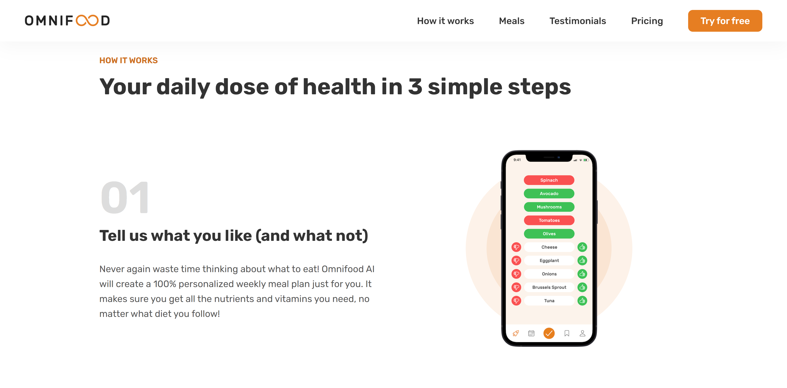
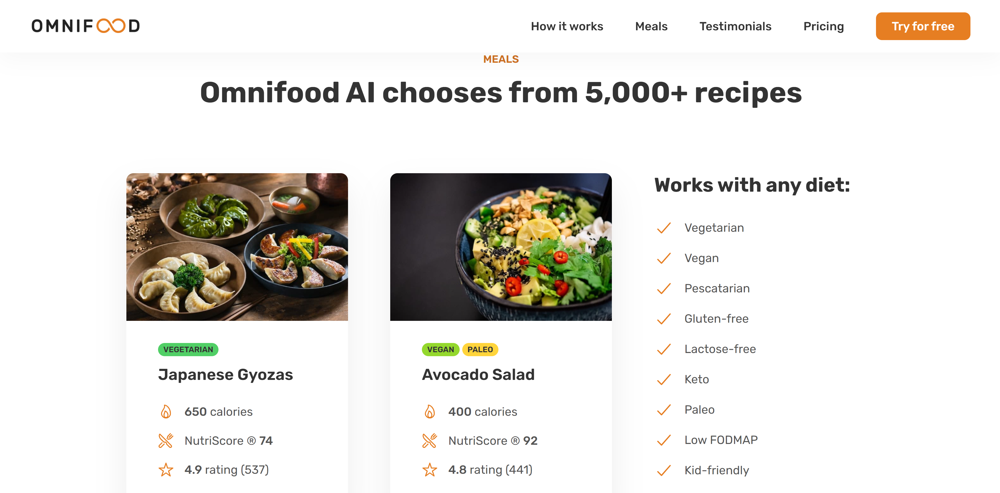

# Omnifood Project

Web application that provides food delivery service based on customers' tastes and nutrition needs (only frontend).

# Motivation

I worked on this project when I took the course [Build Responsive Real-World Websites with HTML and CSS](https://www.udemy.com/course/design-and-develop-a-killer-website-with-html5-and-css3/) taught by instructor Jonas Schmedtmann.

# Screenshots

